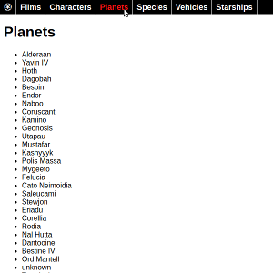

Relaks Star Wars Example - the Sequel
-------------------------------------
This is a continuation of the [Relaks Star Wars Example](https://github.com/trambarhq/relaks-starwars-example). The front-end is now fully built out. Instead of just the character list, all the information provided by [https://swapi.co/](https://swapi.co/) is available. It's also properly integrated with the browser's history functionality. It's a more realistic demonstration of what an front-end built using [Preact](https://preactjs.com/) and [Relaks](https://github.com/trambarhq/relaks) would work.

You can see the code in action [here](https://trambar.io/examples/starwars-v/). You can view its WebPack bundle analysis [here](https://trambar.io/examples/starwars-v/report.html).
When gzipped, it's just around 30 KB.

[](https://trambar.io/examples/starwars-v/)

The example makes use of [relaks-route-manager](https://github.com/trambarhq/relaks-route-manager) and [relaks-django-data-source](https://github.com/trambarhq/relaks-django-data-source).

* [Getting started](#getting-started)
* [FrontEnd](#frontend)
* [Routing](#routing)
* [Character list](#character-list)
* [Character page](#character-page)
* [Other pages](#other-pages)
* [Next step](#next-step)

## Getting started

To see the code running in debug mode, first clone this repository. In the working folder, run `npm install`. Once that's done, run `npm run start` to launch [WebPack Dev Server](https://webpack.js.org/configuration/dev-server/). Open a browser window and enter `http://localhost:8080` as the location.

## FrontEnd

The `initialize()` function ([main.js](https://github.com/trambarhq/relaks-starwars-example-sequel/blob/master/src/main.js)) has changed slightly. The function has to be declared as `async`, since we need to use the `await` operator. It initializes a second object, `RouteManager`. The route manager maps the URL displayed in the browser's location bar to pages in the front-end. It'll intercept clicks on hyperlinks and handle them internally.

```javascript
import { createElement } from 'react';
import { render } from 'react-dom';
import { FrontEnd } from 'front-end';
import { routes } from 'routing';
import DjangoDataSource from 'relaks-django-data-source';
import RouteManager from 'relaks-route-manager';

window.addEventListener('load', initialize);

async function initialize(evt) {
    // create remote data source
    const dataSource = new DjangoDataSource({
        baseURL: 'https://swapi.co/api',
    });
    dataSource.activate();

    // create route manager
    const routeManager = new RouteManager({
        useHashFallback: (process.env.NODE_ENV === 'production'),
        routes,
    });
    routeManager.activate();
    await routeManager.start();

    const container = document.getElementById('react-container');
    const element = createElement(FrontEnd, { dataSource, routeManager });
    render(element, container);
}
```

We'll using hash fallback mode for the production version, so that the front-end will work properly when loaded as a file ([pushState()](https://developer.mozilla.org/en-US/docs/Web/API/History_API#Adding_and_modifying_history_entries)
does not work at a file:// location). It also make hosting the example easier.

The `render()` method of `FrontEnd` ([front-end.jsx](https://github.com/trambarhq/relaks-starwars-example-sequel/blob/master/src/front-end.jsx)) has changed quite a bit. The front-end now has a nav bar. It's
also using a router to determine which page to render:

```javascript
import React, { useState, useEffect, useMemo } from 'react';
import { useEventTime } from 'relaks';
import { SWAPI } from 'swapi';
import { Route } from 'routing';
import { NavBar } from 'widgets/nav-bar';
import 'style.scss';

function FrontEnd(props) {
    const { routeManager, dataSource } = props;
    const [ routeChanged, setRouteChanged ] = useEventTime();
    const [ dataChanged, setDataChanged ] = useEventTime();
    const route = useMemo(() => {
        return new Route(routeManager);
    }, [ routeManager, routeChanged ]);
    const swapi = useMemo(() => {
        return new SWAPI(dataSource);
    }, [ dataSource, dataChanged ]);

    useEffect(() => {
        routeManager.addEventListener('change', setRouteChanged);
        dataSource.addEventListener('change', setDataChanged);
        return () => {
            routeManager.removeEventListener('change', setRouteChanged);
            dataSource.removeEventListener('change', setDataChanged);
        };
    });

    const PageComponent = route.params.module.default;
    return (
        <div>
            <NavBar route={route} />
            <div className="contents">
                <PageComponent route={route} swapi={swapi} />
            </div>
        </div>
    );
}

export {
    FrontEnd
};
```

In addition to route parameters extracted from the current URL, the route object contains a reference to the module used to generate the page. We have to explicitly ask for the `default` export here, because it isn't picked automatically when `require()` or `import()` is used to import a JavaScript module.

## Routing

Route definitions for the front-end's various pages are contained in [routing.js](https://github.com/trambarhq/relaks-starwars-example-sequel/blob/master/src/routing.js). The file also contains the proxy object for the route manager.

The following is one of the routes:

```js
'film-summary': {
    path: '/films/${id}/',
    params: { id: Number },
    load: async (match) => {
        match.params.module = await import('pages/film-page' /* webpackChunkName: "film-page" */);
    }
},
```

`path` is the pattern of matching URLs. It uses the syntax of ES6 variable interpolation.

`params` controls the typecasting of extracted parameters. In this case we want `id` to be a number.

`load` is an async function that loads the module for the page. The module is placed into `match.params.module`, which is referenced by `render()` of `FrontEnd`.

The *webpackChunkName* comment assigns a name to the code chunk holding the module. The name forms part of the name of the resultant JavaScript file. Without it the file would end up with an unintuitive numeric name.

## Character list

The `renderAsync()` method of `CharacterList` ([character-list.jsx](https://github.com/trambarhq/relaks-starwars-example-isomorphic/blob/master/src/pages/character-list.jsx)) is largely the same as before. The only difference is `route` is now passed to to `CharacterListSync` (instead of the callback function `onSelect`).

```javascript
import React from 'react';
import Relaks, { useProgress } from 'relaks';
import { List } from 'widgets/list';
import { Loading } from 'widgets/loading';

async function CharacterList(props) {
    const { route, swapi } = props;
    const [ show ] = useProgress();

    render();
    const people = await swapi.fetchList('/people/');
    render();

    people.more();

    function render() {
        if (!people) {
            return <Loading />;
        }
        show(
            <div>
                <h1>Characters</h1>
                <List items={people} field="name" pageName="character-summary" route={route} />
            </div>
        );
    };
}

const component = Relaks.memo(CharacterList);

export {
    component as CharacterList,
};
```

The `render()` method of `CharacterListSync` has been refactored so that it uses a reusable component to draw the list:

```javascript
/* ... */
```

`List` ([list.jsx](https://github.com/trambarhq/relaks-starwars-example-isomorphic/blob/master/src/widgets/list.jsx)) is a stateless component that draw a list of items:

```javascript
import React from 'react';

function List(props) {
    let { route, urls, items, field, pageName } = props;
    if (urls) {
        // accept single URL and object
        if (typeof(urls) === 'string') {
            urls = [ urls ];
            items = [ items ];
        }
        // deal with holes in the data set
        items = urls.map((url, index) => {
            let item = (items) ? items[index] : null;
            if (!item) {
                item = { url, pending: true };
            }
            return item;
        });
    }
    if (!items) {
        return null;
    }
    if (items.length === 0) {
        return <ul className="empty"><li><span>none</span></li></ul>;
    }
    return <ul>{items.map(renderItem)}</ul>;

    function renderItem(item, i) {
        const id = route.extractID(item.url);
        const url = route.find(pageName, { id });
        const text = item.pending ? '...' : item[field];
        const linkProps = {
            href: url,
            className: (item.pending) ? 'pending' : undefined,
        };
        return <li key={i}><a {...linkProps}>{text}</a></li>;
    }
}

List.defaultProps = {
    field: 'name'
};

export {
    List
};
```

The `find()` method of `route` is used to generate a URL to the summary page of an item. `pageName` corresponds to the key of the desired route in the routing table ([routing.js](https://github.com/trambarhq/relaks-starwars-example-sequel/blob/master/src/routing.js)).

## Character page

The `renderAsync()` method of `CharacterPage` ([character-page.jsx](https://github.com/trambarhq/relaks-starwars-example-sequal/blob/master/src/pages/character-page.jsx)) is also largely unchanged. Instead of receiving `person` as a prop, it's now necessary to fetch the object, using the id from the route.

```javascript
import React, { Component } from 'react';
import Relaks, { useProgress } from 'relaks';
import { List } from 'widgets/list';
import { Loading } from 'widgets/loading';

async function CharacterPage(props) {
    const { route, swapi } = props;
    const [ show ] = useProgress();

    render();
    const person = await swapi.fetchOne(`/people/${route.params.id}/`);
    render();
    const films = await swapi.fetchMultiple(person.films, { minimum: '60%' });
    render();
    const species = await swapi.fetchMultiple(person.species, { minimum: '60%' });
    render();
    const homeworld = await swapi.fetchOne(person.homeworld);
    render();
    const vehicles = await swapi.fetchMultiple(person.vehicles, { minimum: '60%' });
    render();
    const starships = await swapi.fetchMultiple(person.starships, { minimum: '60%' });
    render();

    function render() {
        if (!person) {
            show(<Loading />);
        } else {
            show(
                <div>
                    <h1>{person.name}</h1>
                    <div>Height: {person.height} cm</div>
                    <div>Mass: {person.mass} kg</div>
                    <div>Hair color: {person.hair_color}</div>
                    <div>Skin color: {person.skin_color}</div>
                    <div>Hair color: {person.hair_color}</div>
                    <div>Eye color: {person.eye_color}</div>
                    <div>Birth year: {person.birth_year}</div>
                    <h2>Homeworld</h2>
                    <List urls={person.homeworld} items={homeworld} pageName="planet-summary" route={route} />
                    <h2>Films</h2>
                    <List urls={person.films} items={films} field="title" pageName="film-summary" route={route} />
                    <h2>Species</h2>
                    <List urls={person.species} items={species} pageName="species-summary" route={route} />
                    <h2>Vehicles</h2>
                    <List urls={person.vehicles} items={vehicles} pageName="vehicle-summary" route={route} />
                    <h2>Starships</h2>
                    <List urls={person.starships} items={starships} pageName="starship-summary" route={route} />
                </div>
            );
        }
    }
}

const component = Relaks.memo(CharacterPage);

export {
    component as CharacterPage,
};
```

The `render()` method of `CharacterPageSync` ([character-page.jsx](https://github.com/trambarhq/relaks-starwars-example-sequal/blob/master/src/pages/character-page.jsx)) is also largely the same. Redundant code for drawing lists was refactored out. The method also returns a loading animation when `person` is `undefined`.

```javascript
/* ... */
```

## Other pages

The [other pages](https://github.com/trambarhq/relaks-starwars-example-isomorphic/tree/master/src/pages) are all just copy-and-paste variants of the code described above.

## Next step

In the [next example](https://github.com/trambarhq/relaks-starwars-example-isomorphic), we'll make our front-end isomorphic. It'll render on both the client side and the server side (for the purpose of SEO among other things).
